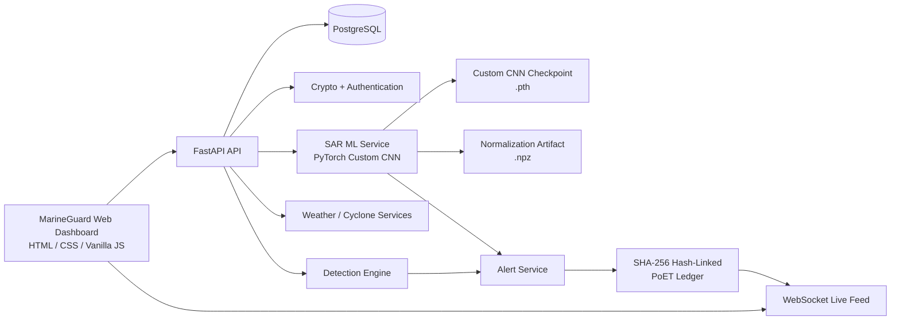
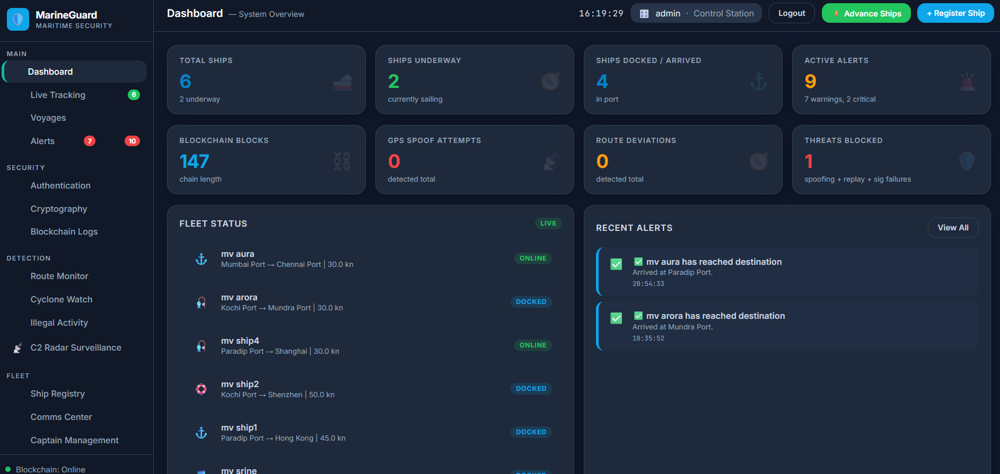
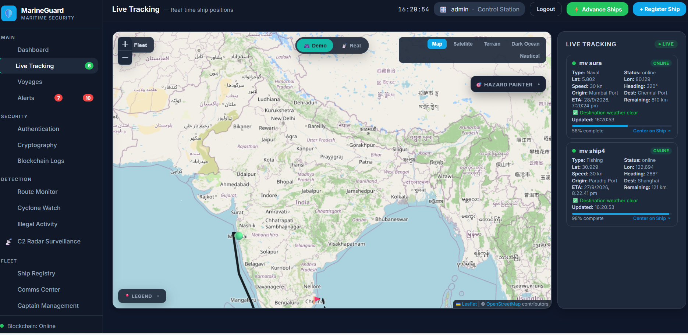
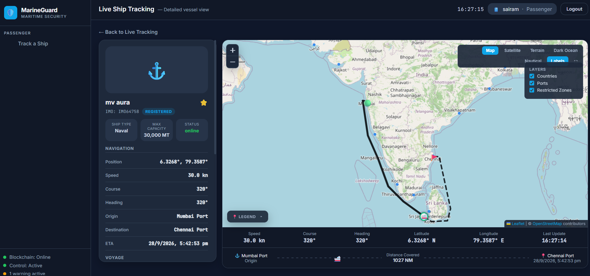
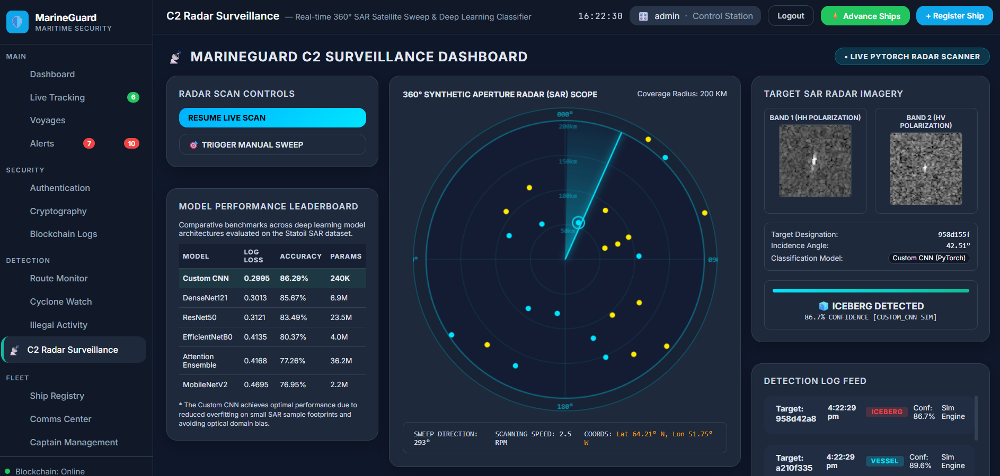
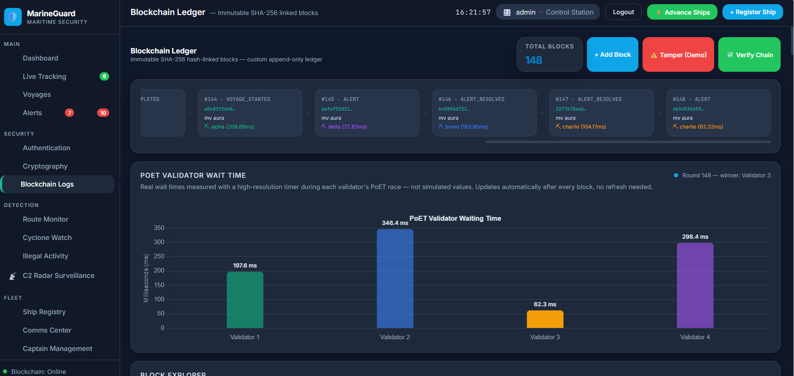

# MarineGuard V2.0 — Secure & Intelligent Maritime Vessel Monitoring System

MarineGuard V2.0 is a full-stack maritime monitoring and security platform that combines **live vessel/voyage monitoring, cryptographic identity and communication, anomaly detection, a tamper-evident PoET blockchain ledger, weather/cyclone awareness, and machine-learning-based SAR target classification** in one operational dashboard.

> **V2.0 upgrade:** MarineGuard now adds a PyTorch Custom CNN for Synthetic Aperture Radar (SAR) target classification, distinguishing **iceberg vs vessel** targets and connecting iceberg classifications to the existing security/navigation alert and blockchain pipeline.

## What changed in V2.0?

| Area | MarineGuard V2.0 |
|---|---|
| ML inference | PyTorch Custom CNN |
| Input | Dual-band SAR backscatter: HH + HV, each 75×75 |
| Derived channel | `(band_1 + band_2) / 2` |
| Classification | Vessel vs Iceberg |
| Model loading | Checkpoint loaded at application startup |
| Normalization | Stored training mean/std artifact with fallback constants |
| Security integration | Iceberg threat → alert → blockchain logging |
| UI | SAR target preview + inference result + radar surveillance view |
| Backend | FastAPI + async SQLAlchemy + PostgreSQL |
| Frontend | HTML/CSS/Vanilla JavaScript + Leaflet + Chart.js |

## Core capabilities

### Maritime monitoring
- Vessel registry and voyage management
- Live position tracking through WebSockets
- Route visualization and deviation detection
- GPS spoofing checks for real/physical position feeds
- Restricted-zone / geofence checks
- Speed and unexpected-stop anomaly detection
- Weather and cyclone monitoring
- Cyclone-aware route/reroute workflow
- Incident and alert management

### Security
- ECC key generation and ship identities
- ECDSA signing and verification
- ECDH session-key derivation
- AES-256 encryption/decryption
- SHA-256 hashing
- Replay protection using nonces
- Mutual-authentication flow
- Hash-linked append-only blockchain ledger
- PoET-style validator wait-time visualization

### Machine learning — V2.0
- PyTorch Custom CNN inference service
- SAR HH/HV dual-band preprocessing
- 3-channel model input: HH, HV, composite
- Vessel/Iceberg classification
- Confidence reporting
- GPU acceleration when CUDA is available; CPU fallback otherwise
- High-confidence iceberg classification can create a critical alert and append it through the existing blockchain alert path

## Architecture



## Project structure

```text
MarineGuard-V2/
├── backend/
│   ├── app/
│   │   ├── blockchain/          # Hash-linked ledger + PoET logic
│   │   ├── crypto/              # ECC, ECDSA, ECDH, AES-256, hashing
│   │   ├── db/                  # SQLAlchemy models/session
│   │   ├── detection/           # Maritime anomaly detection logic
│   │   ├── ml/
│   │   │   ├── artifacts/       # Normalization statistics
│   │   │   └── weights/         # Trained PyTorch checkpoint
│   │   ├── routers/             # FastAPI API routes
│   │   └── services/
│   │       └── ml_classifier_service.py
│   ├── migrations/              # Alembic database migrations
│   ├── requirements.txt
│   ├── .env.example
│   └── README.md
├── frontend/
│   ├── html/index.html
│   ├── css/
│   └── js/
│       ├── main.js
│       ├── sar_classifier.js
│       └── sar_samples.js
├── start.sh
├── .gitignore
└── README.md

## 📸 Screenshots

### System Dashboard


### Live Ship Tracking


### Passenger Ship Tracking


### C2 Radar Surveillance & SAR Classification


### Blockchain Security Ledger


```

## Tech stack

**Frontend**
- HTML5 / CSS3
- Vanilla JavaScript
- Leaflet
- Chart.js
- HTML5 Canvas for SAR/radar visualization

**Backend**
- Python
- FastAPI
- Uvicorn
- Pydantic / pydantic-settings
- SQLAlchemy 2.0 async
- PostgreSQL
- Alembic
- WebSockets

**Security**
- ECC / ECDSA
- ECDH
- AES-256
- SHA-256
- bcrypt
- Hash-linked ledger
- PoET-style validator workflow

**Machine Learning**
- PyTorch
- Torchvision
- NumPy
- scikit-learn
- Custom CNN
- Statoil/CNOOC SAR iceberg-vs-vessel dataset workflow

## ML inference flow

1. The dashboard selects a SAR sample.
2. HH (`band_1`) and HV (`band_2`) arrays are sent to `POST /api/detect/sar-classify`.
3. Each band is validated as a 75×75 matrix (5,625 values).
4. A third channel is generated as `(HH + HV) / 2`.
5. Stored normalization statistics are applied.
6. The tensor is converted to PyTorch `NCHW` format: `(1, 3, 75, 75)`.
7. The Custom CNN performs inference.
8. The output is converted to Vessel or Iceberg with confidence.
9. An iceberg classification is treated as a navigation threat in the current implementation and can generate a critical alert that enters the blockchain-backed alert flow.

### ML API

```text
POST /api/detect/sar-classify
```

The request expects `band_1` and `band_2` arrays containing 5,625 values each. Optional fields include a sample ID, ship ID, latitude, and longitude.

The model artifact is stored at:

```text
backend/app/ml/weights/best_custom_cnn.pth
```

Normalization statistics are stored at:

```text
backend/app/ml/artifacts/normalization.npz
```

## Requirements

- Python 3.12+ recommended
- PostgreSQL
- Git
- PyTorch-compatible CPU or NVIDIA CUDA environment

> The repository intentionally does **not** include a Python virtual environment. Create one locally after cloning.

## Local setup

### 1. Clone

```bash
git clone https://github.com/Supraja73/MarineGuard-V2.git
cd MarineGuard-V2
```

### 2. Create the Python environment

Windows PowerShell:

```powershell
cd backend
py -3.12 -m venv venv
.\venv\Scripts\Activate.ps1
```

If PowerShell blocks activation, you can run the environment's Python directly or use Git Bash / Command Prompt.

Linux/macOS:

```bash
cd backend
python3 -m venv venv
source venv/bin/activate
```

### 3. Install dependencies

```bash
python -m pip install --upgrade pip
pip install -r requirements.txt
```

The requirements include PyTorch, torchvision, NumPy and scikit-learn for V2.0 ML inference.

### 4. Configure PostgreSQL

Create a PostgreSQL database and user, then copy the environment template:

```bash
cp .env.example .env
```

On Windows PowerShell:

```powershell
Copy-Item .env.example .env
```

Update `DATABASE_URL` in `.env` if your PostgreSQL credentials differ.

**Never commit `.env`.**

### 5. Apply migrations

From `backend/`:

```bash
alembic upgrade head
```

### 6. Start MarineGuard

```bash
uvicorn app.main:app --reload --port 8000
```

Open:

```text
http://localhost:8000
```

API documentation:

```text
http://localhost:8000/docs
```

## Important V2.0 implementation note

The current application is configured with **simulation mode enabled by default**. The repository contains a real detection and ML inference pipeline, but it is not a direct production feed from a satellite/SAR provider or live AIS hardware.

The bundled SAR samples in the frontend are used to demonstrate the end-to-end ML inference and alert workflow. A production deployment should replace that sample source with a controlled SAR ingestion pipeline and validated live AIS/GPS/satellite data source.

## Key API groups

| Group | Purpose |
|---|---|
| `/api/ships` | Vessel registration and ship data |
| `/api/voyages` | Voyage lifecycle and routing |
| `/api/positions` | Position reports/history |
| `/api/alerts` | Alert management |
| `/api/detect` | Spoofing, route, zone, speed and SAR detection |
| `/api/weather` | Weather data |
| `/api/cyclones` | Cyclone monitoring |
| `/api/blockchain` | Ledger blocks, statistics and verification |
| `/api/crypto` | Cryptographic operations |
| `/api/auth` | Authentication and key management |
| `/api/comms` | Encrypted communication workflow |
| `/api/dashboard` | Dashboard summary data |
| `/ws/live` | Real-time event stream |

## Database

MarineGuard uses PostgreSQL with SQLAlchemy 2.0 async sessions. Schema changes are tracked using Alembic migrations.

Useful commands:

```bash
alembic current
alembic upgrade head
alembic downgrade -1
alembic revision --autogenerate -m "describe change"
```

Always review an autogenerated migration before applying it.

## Security implementation highlights

- Position signatures are bound to structured server-reconstructed position messages.
- Nonces prevent replay of a previously accepted position report.
- Blockchain verification recomputes hashes and previous-hash links instead of trusting a cached validity flag.
- AES-256 operations validate padding during decryption.
- Concurrent blockchain appends are serialized to protect previous-hash consistency.
- Secrets and database credentials are configured through environment variables rather than committed source files.

## Current limitations / next V2.x work

- Live satellite/SAR ingestion is not included.
- Live AIS/GPS integration depends on an external data source.
- The bundled SAR samples are demonstration inputs rather than a live sensor stream.
- Production deployment should add stronger secret management, HTTPS, restricted CORS, rate limiting, monitoring and operational authentication controls.
- Model evaluation should be documented with a fixed held-out test set and reproducible metrics before making deployment-quality performance claims.

## Why the V2 architecture matters

MarineGuard does not keep ML isolated as a separate demo. The ML inference result is connected to the maritime security workflow: **SAR classification → threat interpretation → alert creation → cryptographic/ledger-backed event trail → live dashboard notification**.

That integration is the central V2.0 engineering upgrade.

## Version

**MarineGuard V2.0**

Secure & Intelligent Maritime Vessel Monitoring System
